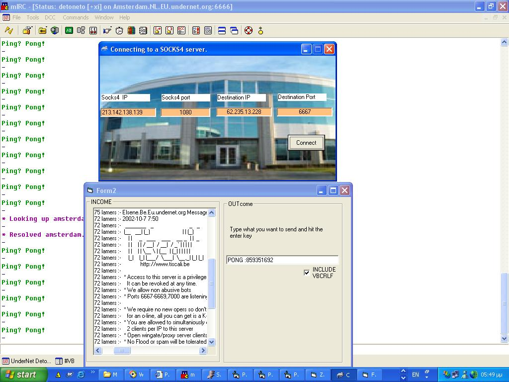



## Finnaly Connect to a SOCKS 4 server via VB\.Commented

### Description

THis programm connects to a SOCK 4 proxy server and tell him to make a onnection with another pc.

In the example(screeenshot) i use my proxy server to conncet to an undernet server.
 
### More Info
 

             |
---                |---
**Submitted On**   |2003-08-15 17:50:32
**By**             |[DetonEtor](https://github.com/Planet-Source-Code/PSCIndex/blob/master/ByAuthor/detonetor.md)
**Level**          |Beginner
**User Rating**    |5.0 (30 globes from 6 users)
**Compatibility**  |VB 5\.0, VB 6\.0
**Category**       |[Data Structures](https://github.com/Planet-Source-Code/PSCIndex/blob/master/ByCategory/data-structures__1-33.md)
**World**          |[Visual Basic](https://github.com/Planet-Source-Code/PSCIndex/blob/master/ByWorld/visual-basic.md)
**Archive File**   |[Finnaly\_Co1630588162003\.zip](https://github.com/Planet-Source-Code/detonetor-finnaly-connect-to-a-socks-4-server-via-vb-commented__1-47745/archive/master.zip)

